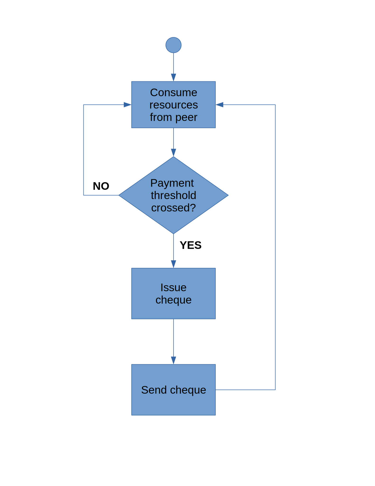

.. _incentivization:

**********************
Incentives system
**********************

.. important::
  Currently, running incentivized nodes is optional. Please refer to chapter  `6.8 <https://swarm-guide.readthedocs.io/en/latest/node_operator.html#connect-to-the-swap-enabled-testnet>`_ for information on how to enable incenvization on your node (currently testnet only). When mainnet is released, enabled incentives will be the default mode.

 
Cryptoeconomics
================
Cryptoeconomics is usually (and somewhat obviously) understood as the intersection of cryptography with economy [`Cryptoeconomics <https://en.wikiversity.org/wiki/Cryptoeconomics>`_].

The cryptographic part in a broader sense encompasses the vast world of cryptocurrencies, blockchain networks and secure digital decentralized systems, while the economics side generally deals with economic *incentives* for network participants. The basic principle is to reward individual network participants in some way for contributing resources to the network at large, with the aim to  ensure smooth and successful operation of a network, guarantee protocol execution, and fulfill end users' requirements.

Every project with cryptoeconomic elements defines its own rules, protocols and incentives system to reward users, which reflect the different needs and operating principles of the specific network.

For Swarm to properly function as a decentralized p2p storage and communication infrastructure, on very basic terms its peers need to:
 * contribute bandwidth for incoming and outgoing requests
 * provide storage for users to upload and retrieve data
 * forward incoming requests to peers who can fulfill them if they can not serve the request themselves

Swarm introduces its own incentives system for ensuring correct network behavior by rewarding nodes for serving these functions. The general swarm docs specify different functional layers of Swarm, which roughly correspond to its implementation roadmap:
 * accounting system
 * file insurance
 * litigation

At this point we only document the accounting system. The other parts will be documented in the future, although they are specified partly already in the documentation [`Incentives system for Swarm <https://swarm-gateways.net/bzz:/swarm.eth/ethersphere/orange-papers/1/sw%5E3.pdf>`_]. Also, this documentation only is meant as an entry point for understanding and operating Swarm. For a thorough and detailed documentation the complete incentives system documentation (linked just above) should be consulted.

Accounting
==========
At the core of Swarm's incentive system is the SWarm Accounting Protocol, or SWAP. It is a very simple protocol which relies on a tit-for-tat p2p accounting model:
 * a node gets rewarded for serving resources
 * a node gets charged for requesting resources

Every peer maintains a local database on its own file system which persists accounting information of all peers with which it exchanged data. On every change, the in-memory accounting structures are updated and immediately persisted to disk in order to avoid synchronization issues.

.. note::

   SWAP excels at its simplicity. It is not the goal and would completely defeat the purpose of the system to introduce bullet-proof consistency and auditing - Swarm is not a blockchain in its own terms.`

.. important::
   The Swarm node operator is responsible for maintenance of the local accounting database (a LevelDB instance). Tampering with it, altering its contents or removing it altogether may result in the node becoming inoperable.

If a node requests data from a peer, when the peer delivers the data, the peer credits an amount equivalent to the price of that message in its local database, at the index representing the node it delivers to. The node, when it receives the message (data) from the peer, debits itself in its local database the same amount at the index of the peer. 

.. image:: img/swap.svg
   :alt: Simple SWAP exchange between two nodes 
   :width: 400

In the above example, A requested data from B, which B then delivers to A (could be a chunk). Assuming a price of 200 units for the chunk, B credits itself in its local database plus 200 at the index for node A, while A, when it finally receives the data from B, debits minus 200 in its local database at the index for node B.

Due to the distributed nature of Swarm nodes, entries in the local databases do not happen simultaneously, and there is no notion of transactions nor confirmations; in normal operation, both nodes account for the message with the correspondent node at the moment of the action (for the sending peer, at the moment of sending, for the receiving peer, at the moment of receiving). 

If a message is being sent, if we would account for it before sending, then a failure in sending would require a complex rollback (or an imbalance). If we send first and then account, then it would not be possible to actually check if there are enough funds. Receiving a message incurs in the same challenge. To address this, Swarm first does a read operation on the database to check if there are enough funds. If positive, the requested operation (send/receive) is performed, and finally if the operation succeeded, the accounting entry is persisted.

Thresholds
----------
As described in the [`Incentives system for Swarm <https://swarm-gateways.net/bzz:/swarm.eth/ethersphere/orange-papers/1/sw%5E3.pdf>`_], this accounting system works by allowing the mutual accounting to oscillate in a defined range. This range is delimited by two thresholds:
* The payment threshold is a number at which if the node goes below that relative to a peer, it should trigger a payment to that peer (a cheque, see below). This is initiated by the debitor node.
* The disconnect threshold is a number at which if the node goes above that number relative to a peer, it can (it's up to the peer but this is the expected behavior) disconnect the peer. This is monitored by the creditor.

The disconnect threshold amount should be bigger than the payment threshold in absolute terms.

Fraud risks
-----------
Of course, the design with individual peer databases means that nodes can alter their database and pretend to have different balances to other nodes. The simplicity of this mutual accounting though effectively significantly limits fraud, as if node A modifies its entry with B, at settlement time, B will verify in its local database that the claim is not matched with its records and simply ignores fraudulent claims. Normal behavior is to disconnect a node in this case. However, we want to make it clear that a node can lose funds up to the disconnect threshold amount due to freeriders.

.. note::

   A peer can be freeriding by consuming resources up to the disconnect threshold. At this point, if there is no settlement, the peer simply gets disconnected.

Imbalances
----------
Imbalances between nodes more generally leads to disconnects from peers. The downside of this is that if node A was able to send an accounted message to B, which successfully left A, but for some reason never arrived at B, then this would lead to imbalances as well. Swarm currently treats this case as an edge case and does not implement any balance synchronization nor clearance protocol to address such cases. It may though be considered for the future.

Settlement with cheques
------------------------
The balance entries for each node in local databases represent just accounting entries in Swarm's internal accounting unit, but are just numbers. The Swarm papers document the notion of a threshold at which finally a financial settlement protocol is initiated. 

If a node's balance with a peer crosses the payment threshold, which is a number every node can set individually (see `swap-payment-threshold` flag), but has a reasonable default defined in the code, then the node kicks off the settlement process. This process involves a series of security and sanity checks, culminating in sending a **signed cheque** to its peer. This signed cheque is a piece of data containing the amount, the source chequebook address and the beneficiary chequebook address, as well as the signature of the cheque issuer. 

The peer, upon receiving the cheque, will initiate a cashing transaction trying to cash the cheque in - this is a transaction on a blockchain and represents real financial value. If the cheque was valid and backed by funds, and thus results in a real transfer of funds from the issuer's contract address to the beneficiary's, the peer will regard the transaction as succesful and reset the balance with the node by the cheque's amount. All of the accounting is maintained per peer and thus threshold crossing and cheque issuance is based on every individual balance with every peer.

Interaction with the blockchain
-------------------------------
A cheque is sent as part of its own lower layer transport protocol (currently on top of `devp2p`, with the planned transition of the whole of Swarm to `libp2p`). The receiving peer handles the cheque and tries to cash it by issuing a transaction on the blockchain. 

Every node has to deploy its own instance of the Swarm smart contract, also often referred to as *chequebook*.  So when receiving a cheque, the beneficiary issues a transaction *on the contract of the issuer of the cheque* as a cashing in request. As the beneficiary is initiating the transaction, it is also the beneficiary who is paying for the transaction. Swarm per default has a check to make sure it financially makes sense to do this: currently the transaction is only started if the payout of the cheque is twice as big as the (estimated) transaction costs. 

The smart contract, after doing the appropriate sanity checks (checking the validity and the funds of the issuer), will transfer the funds from the issuer's contract to the beneficiary contract. If the cheque bounced due to insufficient funds in the issuer, the peer gets disconnected. Again here it is important to understand that a peer is able to freeride up to this threshold. The issuer cannot issue a cheque if there are insufficient funds; normal operation involves a smart contract call to check for funds. If a malicious node sends a bogus, malformed or altered cheque, the cheque will bounce and thus can be identified as fraud attempt, resulting in a disconnect.

Refer to the documentation for details and specification of how the protocol handles subsequent cheques and how this evolves over time.

Starting a SWAP enabled Swarm node thus requires a node to have funds. If no contract address is provided, the node will automatically create one, and a transaction is attempted when the node starts. The user can specify the amount to fund (in WEI) via command line parameter at boot (`swap-deposit-amount`). If the transaction failed, the node does not boot. Afterwards, the node remembers the contract address and uses it for future blockchain interaction.

Currently, the node tries to cash in a cheque right away when it receives it via the protocol. In the future, Swarm might consider making this configurable by the user.

To prevent fraudulent creation of contract addresses for the sake of stealing funds via the protocol, incentivized nodes need to contact an audited factory contract address when creating the new chequebook. For every blockchain, one factory should be deployed. For Ethereum networks, Swarm will provide the network address (and the deployment of the factory). The factory address needs to be configured via command line parameter for incentivized nodes (`swap-chequebook-factory`).

.. important::
  A public incentivized Swarm testnet is currently operational. For information on how to connect to it, please refer to chapter `6.8 <https://swarm-guide.readthedocs.io/en/latest/node_operator.html#connect-to-the-swap-enabled-testnet>`_. The testnet is experimental and funds can be lost at all times. Use only test tokens. The release of the public incentivized mainnet will be announced when launched.

 
Smart contracts
---------------
The smart contract code is open source and there is a separate repo for it: `<https://github.com/ethersphere/swap-swear-and-swindle>`_.

Metrics
-------
There is some instrumentation for observing SWAP performance based on the Swarm node's metrics setup. All metrics can be switched on via the `-metrics` flag. Specific metrics for SWAP are:

 * Number of emitted cheques  ``swap.cheques.emitted.num``
 * Number of received cheques ``swap.cheques.received.num``
 * Amount of emitted cheques  ``swap.cheques.emitted.honey``
 * Amount of received cheques ``swap.cheques.received.honey``
 * Amount of cashed cheques   ``swap.cheques.cashed.honey``
 * Number of bounced cheques  ``swap.cheques.cashed.bounced``
 * Number of errors in cheques processing ``swap.cheques.cashed.errors``

At a lower level, there are more metrics:
 * Amount of bytes credited   ``account.bytes.credit``
 * Amount of bytes debited    ``account.bytes.debit``
 * Amount of accounted units credited     ``account.balance.credit``
 * Amount of accounted units debited      ``account.balance.debit``
 * Amount of accounted messages credited  ``account.msg.credit``
 * Amount of accounted messages debited   ``account.msg.debit``
 * Number of disconnected peers due to accounting errors ``account.peerdrops``, ``account.selfdrops``
 
For more information regarding the metrics system, refer to the chapter `Metrics reporting <https://swarm-guide.readthedocs.io/en/latest/node_operator.html#metrics-reporting>`_. 

Honey Token
===========
Swarm introduces its own token: **Honey**, which is an ERC20 compatible token. The rationale is to allow a homogeneous operation inside the Swarm network in terms of accounting and settlement, externalizing value fluctuations if multiple blockchains are considered. 

For details of emission and token design we have to refer to upcoming documentation which will be published soon. For now we only want to point out that for incentivized nodes to work, the prefunding of the chequebook contract for nodes needs to be done with Honey tokens. 

PricedMessage
=============
All data exchange between Swarm node is based on the underlying transport protocol and is modeled as message exchange. This means that for a node A to send data to a node B means that A sends a message to B. 

Messages are identified by their type. Swarm accounts only for message types which are marked as "accountable". In the go implementation, this is done by implementing the interface `PricedMessage`. 

Currently, only chunk delivery messages are priced. Thus accounting is only effective on messages which deliver chunks to peers. The delivering peer is credited, the receiving peer is debited.

Other message types are exchanged without incurring into accounting (e.g. syncing is free).

Spam protection: Postage Stamps
===============================
As described above, syncing is not accounted for. In Swarm, syncing is the process through which the network distributes chunks based on their hash. When a user uploads a resource to Swarm, the resource is chopped up in 4kB chunks which are content addressed. Based on this address, every chunk gets sent to the peers which are closest to that address for storage. As this is a network internal operation, it should not incur costs.

However, this introduces a major spamming problem: anyone could just upload junk data which would be distributed freely across the network, constituting a denial of service attack.

To counteract this, Swarm uses the analogy of postage stamps from conventional mail carrier systems. In conventional mail delivery, to be able to send a letter, it is usually required to buy a postage stamp to be stuck onto a letter or package. Essentially, it is prepaying for the delivery. Post offices world wide then can verify that the delivery is legitimate by looking at the postage stamp (and verifying that the value is correct).

In Swarm, a postage stamp will be a piece of cryptographic data attached to a chunk. Before uploading a resource, users must attach a postage stamp to its chunks by sending some amount to a smart contract which will then provide the functionality to attach valid stamps to the chunks. Syncing nodes will then look at every chunk and verify that the postage stamp is valid. If it is, the chunks will be forwarded / stored. Otherwise, the chunks will be rejected. In other words, uploads will cost some cryptocurrency. The amount and the details of this operation are still being refined, but it can be anticipated that the amount should be small, as it is only meant to prevent spam.

The implementation of postage stamps is still pending. For details, please consult the postage stamp specification at `Postage Stamps <https://github.com/ethersphere/SWIPs/blob/master/SWIPs/swip-8.md>`_.

Multiple blockchains
====================
Swarm works by connecting different nodes based on their **Network ID**. The network ID is just a number: during handshake nodes exchange their network ID, if it doesn't match, the nodes don't connect.

This same principle applies for incentivized nodes as well. However, in this case, the network ID also represents an actual blockchain network (to be precise, Swarm uses the blockchain network ID). There will be a mapping between network IDs and (public) blockchains. The reason for this is that Swarm per se is blockchain agnostic: although it was initially designed to work with Ethereum, it can potentially work with any blockchain (and currently most easily with any Ethereum-compatible platform).

Incentivized nodes exchange their contract address during handshake (in order to send each other cheques later). Thus, if the contract addresses would not be on the same smart contract platform, the cheques would fail. Therefore, incentivized nodes **must run on the same blockchain platform (backend)** for incentivization to work properly (strictly speaking, they could work in an agnostic mode as long as no cheque is being exchanged, as SWAP would be accounting independently, but settlement would not be possible).

.. important::

   Incentivized nodes need to be connected on the same smart contract platform.

Incentivized nodes need to provide their operating blockchain platform at boot via command line parameter (`swap-backend-url`).

